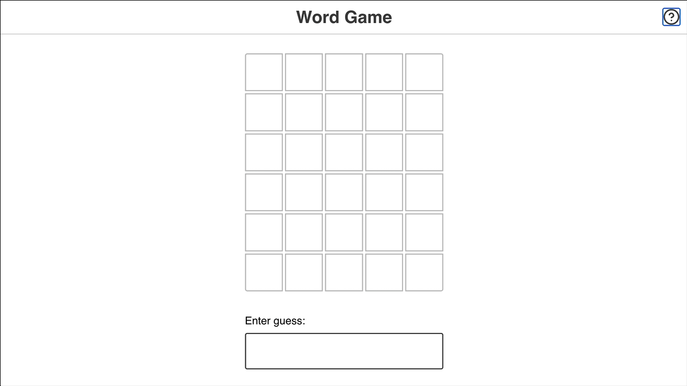

# EmulatingWordle 

## Overview

This project is a recreation of the popular online word game, Wordle. Players have six attempts to guess a five-letter word, receiving feedback on their guesses to help them identify the correct letters and their positions.



## Features

- **User Input**: Players can enter their guesses through a text input or by clicking on a visual keyboard.
- **Feedback Mechanism**: The game provides immediate feedback on each guess, indicating whether letters are correct, misplaced, or incorrect.
- **Guess History**: Displays all previous guesses in a grid format.
- **Restart Functionality**: Players can restart the game to try again with a new word.
- **Responsive Design**: The game is fully responsive and works on various screen sizes.

## Getting Started

### Prerequisites

- Node.js (version 14 or higher)
- npm (Node Package Manager)

### Installation

1. Clone the repository:
   ```bash
   git clone https://github.com/yourusername/wordle-clone.git
   cd wordle-clone
   ```

2. Install the dependencies:
   ```bash
   npm install
   ```

3. Start the development server:
   ```bash
   npm start
   ```

4. Open your browser and navigate to `http://localhost:1234` to view the game.

## Usage

- Enter your guess in the input field and press "Enter" or click the corresponding letter on the visual keyboard.
- The game will provide feedback on your guess, highlighting correct letters in green, misplaced letters in yellow, and incorrect letters in dark gray.
- You can restart the game at any time by clicking the "Restart Game" button displayed at the end of the game.

## Game Logic

The game logic is implemented in the `src/game-helpers.js` file, where the `checkGuess` function evaluates the player's guess against the correct answer. The statuses returned by this function are used to update the visual representation of the guesses.

## Technologies Used

- React
- JavaScript
- CSS
- Parcel (for bundling)

## Contributing

Contributions are welcome! If you have suggestions for improvements or new features, please open an issue or submit a pull request.

1. Fork the repository.
2. Create a new branch:
   ```bash
   git checkout -b feature/YourFeature
   ```
3. Make your changes and commit them:
   ```bash
   git commit -m "Add some feature"
   ```
4. Push to the branch:
   ```bash
   git push origin feature/YourFeature
   ```
5. Open a pull request.

## License

This project is licensed under the MIT License - see the [LICENSE](LICENSE) file for details.

## Acknowledgments

- Inspired by the original Wordle game.
- Thanks to the [Joy of React](https://courses.joshwcomeau.com/joy-of-react/) course for guidance and structure.
